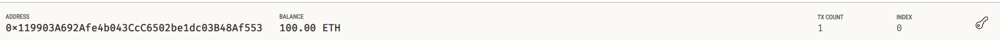
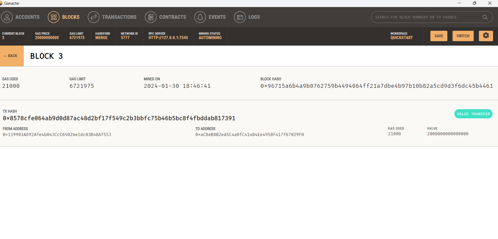
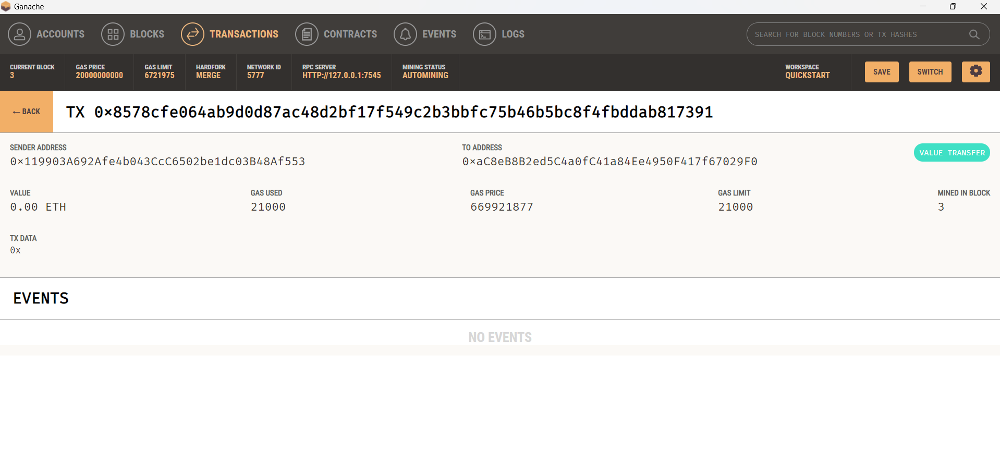

# Ethereum_Blockchain_Network
The purpose is to enable the customers to instantly pay their hired fintech professionals with cryptocurrency.

To develop the code and test it out, I assumed the perspective of a KryptoJobs2Go customer who is using the application to find a fintech professional and pay them for their work.

With the current alloted Ether available and the prospective fintech professionals that were avaiolablke for my choosing, I decided to hire Lane. Her rating of 4.3 along with her hourly rate of 0.2 eth made the most sense for my needs. I have hired her for 0.01 hours of work. 

The following screen shots show my adress balance in Ganache, along with the respective block & transaction details. 

